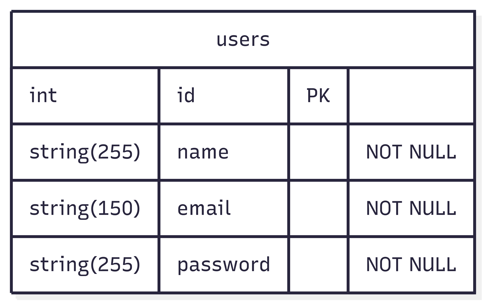

# Teste Cwi Vaga PHP Pleno (Laravel + Node + Microsserviços)

Teste Técnico para a empresa Cwi onde o objetivo é criar duas instancias de microserviços, uma em Laravel (PHP) e outra em  Express (Node.js)


## Documentação

Todas as documentações estão na pasta ```Docs/```

### Diagrama ER 


Esse é um diagrama simples da estrutura do banco de dados. 


### Documentação de rotas

O Arquivo [Rotas.md](Docs/Rotas.md) contem os detalhes das rotas e quais paramentos as rotas esperam. 

Dentro da pasta Docs também há o arquivo de exportação do Postman; só é preciso alterar a URL para que as rotas funcionem corretamente.

### Serviços 

  #### userService
    Serviço feito com Laravel para ser utilizado  como ponto focal dos usuários, criação, edição, e entre outros serão todos utilizados a partir deste Serviço

  #### subscriptionService
    Serviço em Node que irá retorar as informações de assinatura de um serviço com base no Email do usuário


## Variáveis de Ambiente

Para rodar esse projeto, você vai precisar adicionar as seguintes variáveis de ambiente no seu .env 

### subscriptionService
```
PORT=3000
API_TOKEN=1BoEamShYxjhjtL
``` 

### userService
APP_URL=http://localhost:8000
API_SUBSCRIPTION_URL=url_da_aplicação_node/api/subscriptions/
DB_CONNECTION=mysql
DB_HOST=mysql
DB_PORT=3306
DB_DATABASE=usersServices
DB_USERNAME=root
DB_PASSWORD=root


## Rodar Localmente. 

Para Rodarmos as duas aplicações, primeiro devemos criar os .env em seus respectivos Serviços, após isso 
podemos rodar o comando


```
docker-compose up -d --build
```

Podemos enfrentar alguns problemas, relacionados a API_KEY da aplicação, caso encontre basta rodar o seguinte comando

```
docker compose exec user-service php artisan key:generate
```
ou fora do docker apenas
```
php artisan key:generate
```


Após isso rodamos as  migrations e seeds para popularmos o banco de dados e termos alguns dados para trabalharmos

```
docker compose exec user-service php artisan migrate
docker compose exec user-service php artisan db:seed
```

após isso rodamos o comando:

```
docker compose up
```
e os dois sistemas estarão prontos para serem utilizados


## Ferramentas Utilizadas


## Autores

- [Bruno Alves](https://github.com/Brunoazzireluto/)

